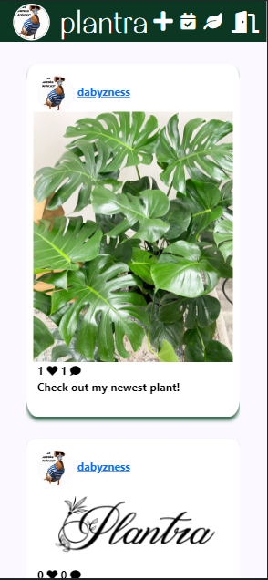

# PLANTRA

#

## About

Welcome to Plantra, a place to track and share your plants with the world. Set a watering schedule for your plants, check your calendar to see which plants you have to water, upload pictures of your plants and keep track of it's growth! View what others are posting and like and comment to see their plant collection!

Try Plantra [here](https://plantra.fly.dev/)!

#

## Functionality

Upon logging in, new users are are greeted with a page to create a username, a bio, upload an avatar, and select the Plant Hardiness Zone of your location. Returning Users will be immediately to the home page, which displays a feed of other users posts.

Clicking on your avatar in the navigation bar takes you to your profile. Your profile view contains your bio, zone, followers, and a view of your posts and plants.

Clicking on a post or plant will take you a new page to view that post. On a Post page, you can like and comment a post. On a plant page you can add notes or add more pictures of your plant. You can also delete your plant if it dies. Unfortunately there is no "graveyard" to view all of your plant children that you've failed as a plant parent.

To add a new plant to your collection, you must click on the '+' icon located directly to the right of the "number of plants" icon in your profile view. It will take you to a screen where you can nickname your plant and add a watering schedule. A picture is required as proof that you do in fact own this plant. We at Plantra do not take kindly to liars.

In order to add a new Post, click on the '+' icon in the center of the navigation bar. You will be taken to a new page where you can upload a picture and a description of your post. After submitting the post, you will be taken to the view of your Post. From there, feel free to like your own post so that you'll always have at least 1 like.

If you try to add a plant to your collection that is not yet in the database, feel free to reach out to the admins to add a plant for you. At this moment in time, there are no admins so add as many fake plants as you want. Please do not add any fake plants, I'd have to go into the database to delete them myself as I have not implemented that feature as I'd then have to go through every user and also delete any plants they have with the same id.

Click in the navigation pane to view all plants that are currently in the database available to add, and also to view your plants that need to be watered!

#

## Technologies Used

- Javascript
- HTML
- CSS
- EJS
- Express
- MongoDB
- Google OAuth 2.0
- AWS S3 Bucket
- Bootstrap
- Trello + Whimsical
  - [Link to Wireframe](https://trello.com/b/JdyZV25G/unit-2-project)

## Future Tasks

- [ ] Responsive Design
- [x] Infinite Scroll
- [ ] Admin Features
- [ ] Nested Comments
- [ ] Ability to view profiles/posts for Guest Users

#

## Shout-Outs

### Assets

- FontAwesome
- GoogleFonts
- Coolors
- My Fiance's Plants

### People who Assisted Me

- David + Emily on S3 functionality
- Jess + Steph for keeping my sanity in check

#

## Notes

I had a lot of fun making a mobile-first, full CRUD, MEN-stack web app. I tried my best to emulate the functionality of Instagram as it has a very intuitive UI and I think with the week that I was given to complete this project I did a pretty decent job. The hardest part was probably testing to make sure everything worked as it intended, but I think the most rewarding was setting up an AWS S3 bucket in order to upload and store pictures. Overall, this was a difficult and stressful project, but I'm happy with the results.

#

## Additional Screenshots
